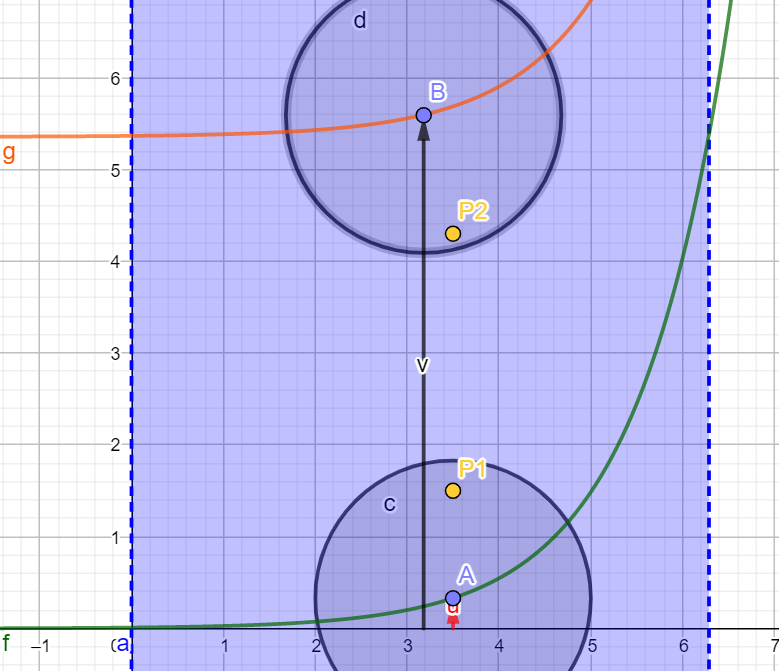
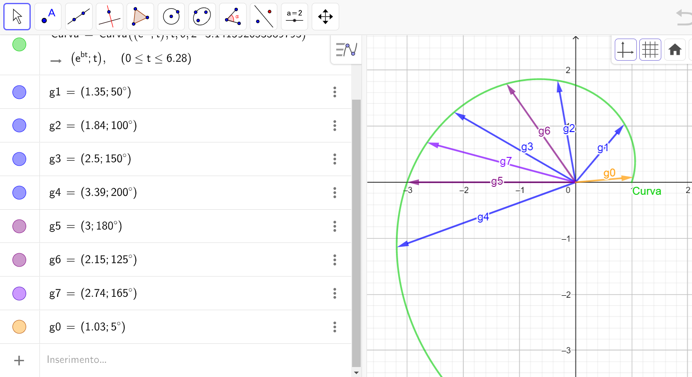

# Olimpiadi Automazione Siemens 2022
  Progetto Looking For Troubles "L4T"

Realizzato in collaborazione tra:
- <b> [Fermi-Giorgi Lucca](https://www.polofermigiorgi.edu.it/) </b>
- <b> [Galilei-Artiglio Viareggio](http://www.iisgalileiartiglio.edu.it/) </b>
- <b> [Körber Tissue Lucca](https://www.koerber-tissue.com/it/) </b>

Questo lavoro è stato ispirato dalla figura di un illustre toscano, uno dei più grandi matematici di tutti i tempi : Leonardo Pisano detto il [Fibonacci](https://it.wikipedia.org/wiki/Leonardo_Fibonacci) 

## Finalità
Il presente lavoro ha come finalità l’individuazione rapida di guasti e/o malfunzionamenti di una macchina o di un impianto complesso e di fornire al manutentore dei video-tutorials lanciati direttamente su smartphone o su altri device in dotazione in base al codice guasto comunicato dal PLC S7-1500.
Può accadere infatti, come descritto nel caso studio, che un prodotto sia affetto da difetti a seguito di un malfunzionamento di un processo che non necessariamente è segnalabile attreverso un guasto vero e proprio inteso come intervento di una protezione o di un relè, ovvero di un fermo macchina. Questo tipo di  malfunzionamento può essere individuato attraverso l'informazione prodotta dalla catena di sensori esistenti, i cui segnali forniscono una "impronta" (o impronta dell'evento guasto) che può essere riconosciuta da un sistema esperto quale una rete neurale che associa appunto al malfunzionamento, alla particolare impronta che differisce da quella di corretto funzionamento, il difetto del prodotto. Essendo la rete neurale installata su un PLC inserito nella rete di impianto, il difetto è immediatamente segnalato al manutentore per un intervento rapido e preciso. Per semplicità descrittiva chiameremo di seguito i malfunzionamenti con l'accezione piu' generica di guasto, anche se come già ribadito non necessariamente tali eventi comportano la rottura o il fermo macchina oppure il blocco di un processo produttivo. Ciò non toglie che il modello sia in grado di riconoscere anche impronte di guasto relative a fermi macchina. 

Operativamente la localizzazione degli stati di guasto avviene sul piano attraverso coordinate polari che descrivono una particolare spirale logaritmica. Tale traiettoria opportunamente supportata da informazioni provenienti da sensori specifici, potrebbe descrivere lo stato di funzionamento della macchina utile per la manutenzione predittiva.
Piu’ semplicemente la spirale logaritmica si adatta allo scopo anche con pochi dataset iniziali per impronte di guasto chiaramente definite e che presentano una ridotta variabilità.

## Ambiti di applicazione
Lo strumento di ricerca guasti del presente lavoro può essere applicato in tutti gli scenari dell'industria manifatturiera per l'individuazione di errori di azionamenti complessi oppure in impianti complessi dove piu' parametri fisici, acquisiti sottoforma di segnali analogici, forniscono indicazioni circa lo stato dell'impianto, come ad esempio centrali di produzione dell'energia o in campo nautico nel monitoraggio della sala macchine di grandi imbarcazioni. Piu' avanti sarà presentato il [caso studio](#caso-studio), ovvero l'applicazione in campo manifatturiero.

## Descrizione generale del modello
Il modello si basa sull’idea che gli stati di guasto di una macchina o di un impianto complesso possano essere associati ad un percorso descritto da una funzione come ad esempio la [spirale aurea](https://it.wikipedia.org/wiki/Spirale_aurea). Tale scelta, di notevole valenza didattica per le diverse implicazioni matematiche e storico-filosofiche ovvero con ricadute multidisciplinari, si è rilevata efficace anche da un punto di vista pratico stimolando al contempo la curiosità degli studenti.
Di fatto si tratta di un algoritmo [Adaline](https://en.wikipedia.org/wiki/ADALINE) dove una combinazione lineare di determinati valori di input <b>x</b> e un corrispondente vettore di pesi <b>w</b> costituiscono l'argomento della funzione di attivazione. Il principio su cui si basa il modello sarà chiarito piu' avanti, ma in sostanza la funzione di attivazione è semplicemente una funzione che restituisce il modulo ovvero l'angolo per il feedback, ed attraverso l'impiego di un quantizzatore stabilisce l'etichetta del guasto come illustrato nella figura successiva

Con la spirale logaritmica al crescere dell'angolo cresce anche il modulo del vettore di addestramento e questo consente di addestrare matrici di pesi differenti anche in caso di angoli multipli. 
C'è pero' una differenza sostanziale da sottolineare. In Adaline la funzione di attivazione è lineare 

Questo significa che in Adaline la matrice dei pesi stabilisce una retta, un piano o un iperpiano che ***separa*** le etichette. 
Nel modello adottato in questo lavoro la funzione di attivazione 

addestra i pesi in modo da stabilire settori o intorni dei vettori di riferimento che ***raccolgono*** le etichette di guasto.

## Impronta dell’evento guasto
Quando un evento riconducibile ad un guasto produce un allarme rappresentato da una serie di segnali booleani e/o analogici in cascata che aumenta con l’aumentare della complessità del sistema, può essere utile studiare “l’impronta” che connota tale evento per aiutare il manutentore ad intervenire e risolvere il problema nel piu’ breve tempo possibile.
Ora se l'impronta lasciata da questo evento (per impronta si intende la sequenza di bit, l'istante di tempo in cui commutano, la loro durata, eventuali altri segnali analogici ecc.) sono sempre ed esattamente tutti uguali per ogni evento indifferentemente dalla causa che lo genera, allora è sufficiente un calcolo combinatorio (es. mappa Karnaugh) per stabilire con certezza l’origine del guasto.
Se invece l’impronta dell’evento cambia leggermente di volta in volta pur essendo la causa scatenante la stessa, allora l’impiego di una rete neurale installata direttamente sul PLC può essere una valida alternativa per l’individuazione del guasto.
Possiamo pensare di rappresentare questo ragionamento con una serie di immagini composte da matrici luminose dove ogni luce rappresenta la sequenza e la durata dei bit che intervengono a seguito del guasto.

A prima vista le tre impronte sembrano uguali ma osservando attentamente si possono notare leggere differenze. In questo caso il riconoscimento dell’immagine può essere affidato ad un sistema esperto, previo addestramento, come ad esempio una funzione retro-azionata che aggiorna i pesi proprio come fa una rete neurale. Chiameremo tali *“matrici luminose”*, **matrici dataset**. Per spiegare meglio l’idea è possibile fare ricorso alla seguente rappresentazione grafica 

Durante la fase di addestramento sono determinati i pesi della funzione per ogni dataset di guasto.
Durante la fase di riconoscimento è valutata sul piano la posizione del nuovo dataset ed associato al punto di guasto piu’ vicino. 

Nel caso di figura il modello propone al manutentore il video-tutorial relativo alla riparazione del guasto 3. Se la previsione non è confermata, il sistema propone il video-tutorial del guasto 2. In questo caso è possibile correggere i pesi addestrando il modello tenendo conto del nuovo scenario.

In seguito è proposto il [caso studio](#caso-studio) ovvero l'attività condotta dagli studenti in Körber Tissue. L'azienda infatti ha organizzato una due giorni di prove mettendo a disposizione per gli studenti la linea pilota per le prove in situ.  

## Video di presentazione del progetto
<html lang="it"> 
<body>
    

         <!-- finestra popup 3 -->
        
        

            

         <!-- il link you tube deve essere selezionato dal link di rete lasciando la cartella embed -->
		    <iframe width="640" height="320" src="https://youtube.com/embed/ciXYPWPF-EE" ></iframe>
            

            
        

    

</body>
</html>

<b>
Programmi TIA Portal
</b>
- per scaricare il programma di simulazione utilizzato in laboratorio per studio di fattibilità clicca [qui](https://github.com/looking-for-troubles/L4T/tree/gh-pages/TIA_simulation)
- per scaricare il programma operativo utilizzato in azienda Körber Tissue clicca [qui](https://github.com/looking-for-troubles/L4T/tree/gh-pages/TIA_operating)

## Chatterbot con Telegram
Per poter interagire con la chat del manutentore occorre aprire [Telegram](https://web.telegram.org/z/) e cercare il bot **@incercadiguai_bot**.
E' possibile interagire con il bot attraverso domande generiche che all'occorrenza sono memorizzate dal bot stesso per poterle riutilizzare successivamente nella conversazione. In altri termini quando il bot impara nuove parole proverà a riutilizzarle nel tentativo di costruirsi un proprio lessico.
Tuttavia le risposte ad alcune domande specifiche di natura tecnica non hanno margine di interpretazione ma sono di tipo assiomatico. E' questo il caso ad esempio dei codici di guasto.
Digitando i numeri da 1 a 7, che semplicemente rappresentano appunto i codici di guasto riconosciuti in fase di addestramento del PLC per il [caso studio](#Caso-Studio), è possibile ricevere le informazioni circa il ripristino del guasto. Naturalmente i video caricati hanno valenza didattica. In uno scenario industriale tali video potrebbero essere disponibili già in fase di progettazione direttamente dal software Digital Twin come ad esempio [NX di Siemens](https://www.plm.automation.siemens.com/global/it/products/nx/). Infatti la manutenzione straordinaria, ordinaria o programmata che dir si voglia, non è un mero atto finale, una attività svincolata dal processo progettuale ma anzi orienta le scelte costruttive al fine di migliorare i costi di esercizio e la durata di vita del prodotto. Di seguito si riporta un breve video per la ricerca e l'uso del bot da parte del lettore.

<html lang="it"> 
<body>
    

         <!-- finestra popup 3 -->
        
        

            

         <!-- il link you tube deve essere selezionato dal link di rete lasciando la cartella embed -->
		    <iframe width="640" height="320" src="https://youtube.com/embed/4UuhS8_9AMk" ></iframe>
            

            
        

    

</body>
</html>

E' possibile accedere ai video anche da questa pagina cliccando sul relativo numero di guasto dell'elenco seguente:
- [1](https://looking-for-troubles.github.io/g1/)
- [2](https://looking-for-troubles.github.io/g2/)
- [3](https://looking-for-troubles.github.io/g3/)
- [4](https://looking-for-troubles.github.io/g4/)
- [5](https://looking-for-troubles.github.io/g5/) e [6](https://looking-for-troubles.github.io/g6/) 
- [7](https://looking-for-troubles.github.io/g7/)

# Abbecedario matematico
Di seguito si riassumono alcuni concetti fondamentali utilizzati nella definizione del modello matematico caricato nel PLC S71500 Siemens.
La descrizione degli oggetti utilizzati segue lo schema di figura partendo dagli ingressi o matrice di dataset, passando per la funzione logaritmica fino alla retroazione di aggiornamento dei pesi

## Spirale Logaritmica
Prima di affrontare l'aspetto matematico di seguito si ribadisce l'opportunità della scelta della spirale logaritmica. 
La spirale logaritmica riportata su un piano polare assume la seguente forma

La spirale logaritmica piu' famosa è la [spirale aurea](https://it.wikipedia.org/wiki/Spirale_aurea) che può essere rappresentata anche attraverso una successione geometrica di [rettangoli aurei](https://www.geogebra.org/m/azsspzyb) aventi i lati di dimensioni pari alla successione di [Fibonacci](https://it.wikipedia.org/wiki/Leonardo_Fibonacci)

Se prendiamo la funzione e la studiamo nel piano cartesiano si osserva che per ogni angolo esiste un modulo associato. Nella figura seguente la sezione in colore azzurro rappresenta il campo di esistenza compreso tra 0 e multipli di due volte pigreco 

Gli stati noti di seguito rappresentati differiscono di circa un angolo giro

Se i due punti P1 e P2 rappresentano due stati distinti di guasto, è possibile ricondurre ciascuno ai guasti noti afferenti alle curve g e f

## Matrice dei dataset
La matrice dei dataset ha dimensione nx3.
- La prima colonna della matrice rappresenta lo stato degli allarmi in termini booleani 
- La seconda colonna rappresenta i tempi di arrivo degli allarmi che prima di essere caricati nel DB subiscono una normalizzazione
- La terza colonna rappresenta l’ordine di arrivo della sequenza degli allarmi

## Matrice dei pesi
La matrice dei pesi è aggiornata dal feedback durante l’addestramento della rete di apprendimento automatico ed ha dimensione nx3.
- La prima colonna della matrice rappresenta i pesi degli allarmi
- La seconda colonna rappresenta i pesi del tempo di arrivo della sequenza degli allarmi
- La terza colonna rappresenta i pesi dell’ordine di arrivo della sequenza degli allarmi

## Funzione “z” o ∅(z)
Un tipo di guasto riconducibile alla matrice dei dataset e dei pesi è individuabile attraverso la seguente relazione

Operativamente la matrice dei dataset x (nx3) è proiettata attraverso la trasposta matrice dei pesi W (3×n) secondo la relazione W^T∙x=Z  in uno spazio 3x3. 

Della matrice risultante Z è calcolata la somma della diagonale principale che costituisce l’input di rete

## Aggiornamento dei pesi
La spirale logaritmica 

 

è utilizzata nel feedback per la stima dei pesi, mentre la funzione di costo da minimizzare è

dove Y rappresenta il termine noto per l’addestramento ed è, in questo contesto, il modulo relativo al tipo di guasto che giace sulla traiettoria della spirale logaritmica

Posto 

 

la variazione dei pesi (derivata parziale) della spirale logaritmica sarà

 

Applicando il metodo della discesa del gradiente sulla funzione di costo per la ricerca dei pesi si ha

Il cambiamento del peso è definito come il gradiente negativo moltiplicato il tasso di apprendimento 

Sostituendo si ha

che costituiscono gli aggiornamenti dei pesi a seguito del feedback

# Caso Studio
L'azienda [Körber Tissue Lucca](https://www.koerber-tissue.com/it/) 

ha aderito alla proposta avanzata dai due istituti tecnici circa la possibilità di sperimentare sul campo l'idea di un modello addestrabile in SCL con PLC S7 1500, rendendosi da subito disponibile attraverso incontri preparatori online già nel periodo estivo prima dell'inizio dell'anno scolastico 2021-2022. 

L'alta professionalità dell'azienda Körber combinata con la professionalità e l'esperienza del settore Tissue presente sul territorio ha favorito la giusta alchimia tra il mondo dell'impresa e quello della scuola, permettendo l'applicabilità dello strumento operativo denominato L4T

## Obiettivo del caso studio
A seguito di incontri online ed in azienda, è stata individuata una sezione di impianto su cui testare lo strumento L4T per il riconoscimento guasti.
Tale sezione di impianto prende il nome di incollatrice. Si tratta di una parte assai complessa ed innovativa della linea Pilota che svolge la funzione di incollaggio dei prodotti con performance uniche nel suo genere.
Preme qui ribadire quanto già detto all'inizio del presente lavoro, ovvero che con il termine guasto si indendono anche i malfunzionamenti di un processo che possono portare ad un difetto del prodotto. Nello specifico l'incollatrice attraverso un complesso sistema di posizionamento con rulli controruotanti ed ugelli ad aria, è in grado di incollare il lembo sottile di un rotolo di carta al secondo. Di seguito sono descritte sommariamente le fasi principali che prevedono:
- l'ingresso del rotolo nell'incollatrice;
- il suo posizionamento;
- il distacco del lembo attraverso l'aria soffiata per un certo tempo e con una certa lunghezza;
- l'attivazione di una lama imbevuta di colla da trasferire al lembo;
- la rotazione del rotolo su se stesso per l'incollaggio del lembo;
- il trasferimento del rotolo per il confezionamento.

In ciascuna di queste macro-fasi è possibile che si verifichi un "evento indesiderato" come ad esempio l'eccessiva o la ridotta lunghezza di distacco del lembo o la quantità di colla presente sulla lama, per ottenere un prodotto che non risponde allo standard di qualità richiesto.
Vedremo di seguito che questi scostamenti rispetto allo standard, sono stati rilevati attraverso una analisi dei segnali dei sensori presenti raccolti in un opportuno dataset di ingresso.

L'incollatrice utilizza *interamente* tecnologia Siemens compreso i PLC S7 1500 per la regolazione ed il controllo. In questo scenario favorevole si è pensato di creare un nuovo indirizzo IP da dedicare al "PLC L4T" in modo da integrarlo a tutti gli effetti nella rete dell'impianto per le prove in situ con gli studenti.
A tal fine l'azienda ha predisposto uno spazio fisico attrezzato di fronte alla sezione oggetto di studio, con posti a sedere e un banco con alimentazione elettrica e presa di rete su cui gli studenti ed i docenti potessero svolgere i test in piena sicurezza.

## Programma di simulazione per lo studio preliminare di fattibilità
Prima di poter operare direttamente sull'incollatrice è stato necessario simulare nei laboratori scolastici l'impianto attraverso un PLC S7-1200 in grado di generare dei dataset di guasto in modo random ed un PLC S7-1500 contenente il modello addestrato per il riconoscimento. La comunicazione tra i due PLC è stata realizzata con le funzioni TSEND_C e TRCV_C.
I due PLC sono stati collegati in rete insieme ad un HMI TP1500 Comfort grazie al quale è stato possibile addestrare il modello ed effettuare le simulazioni di riconoscimento.

Il programma di simulazione redatto con Tia Portal V16 è scaricabile [qui](https://github.com/looking-for-troubles/L4T/tree/gh-pages/TIA_simulation).

Questa fase preliminare possiamo definirla uno studio di fattibilità utile per capire l'effettiva applicabilità del modello al contesto del caso studio.
Per fare questa analisi preliminare l'azienda Körber Tissue Lucca ha effettuato alcune prove sull'incollatrice fornendo una serie di dataset in formato Excel che mettiamo a disposizione del lettore cliccando [qui](https://github.com/looking-for-troubles/L4T/tree/gh-pages/dataset). **ATTENZIONE: se si vuole caricare manualmente i vari dataset nel programma di simulazione occorre dividere i valori riportati nel foglio Excel per 1000 (millisecondi) corrispondenti alla scala dei tempi di intervento dei sensori dell'incollatrice**.  Dai dataset forniti sono stati estrapolati scenari random compresi tra i valori massimi e minimi reali, utilizzando la libreria LGF di Tia Portal.
Gli angoli scelti associati a ciascun guasto ed utilizzati per l'addestramento sono riportati nella figura successiva

Gli studenti coinvolti nel progetto hanno svolto la fase di primo addestramento a scuola seguendo la procedura descritta nel video seguente. I risultati della simulazione hanno fornito indicazioni circa il numero di addestramenti necessari da compiere sul programma operativo da testare sull'impianto.

<html lang="it"> 
<body>
    

         <!-- finestra popup 3 -->
        
        

            

         <!-- il link you tube deve essere selezionato dal link di rete lasciando la cartella embed -->
		    <iframe width="640" height="320" src="https://youtube.com/embed/5v5LbZU4Pk4" ></iframe>
            

            
        

    

</body>
</html>

A seguito dei risultati incorraggianti del programma di simulazione si è proceduto alla realizzazione del programma operativo descritto al paragrafo successivo

## Programma operativo di riconoscimento guasti  
Il programma operativo di riconoscimento guasti è stato realizzato per la prova in situ sull'impianto Körber Tissue. Per questa attività pratica l'azienda ha predisposto un indirizzo IP ed un collegamento GSD oltre che ad uno spazio di lavoro che ha consentito agli studenti di seguire le prove comodamente in totale sicurezza. Il programma operativo redatto con Tia Portal V16 è scaricabile [qui](https://github.com/looking-for-troubles/L4T/tree/gh-pages/TIA_operating). Il funzionamento generale del programma è descritto nel video successivo

<html lang="it"> 
<body>
    

         <!-- finestra popup 3 -->
        
        

            

         <!-- il link you tube deve essere selezionato dal link di rete lasciando la cartella embed -->
		    <iframe width="640" height="320" src="https://youtube.com/embed/6JoK_H_QakI" ></iframe>
            

            
        

    

</body>
</html>

I risultati ottenuti con il software operativo sono riportati nelle conclusioni finali del presente lavoro

## Rappresentazione visiva di alcuni dataset  
Per rendere meglio l'idea di che cosa il modello matematico deve essere in grado di riconoscere, si propone un videoquiz per il lettore realizzato con due matrici luminose a confronto che riproducono dataset simili. Il led luminosi sono indirizzabili e attraverso l'uso di un ESP32 programmato in microPython sono state prodotte le sequenze dei bit in colore diverso che rappresentano dinamicamente le impronte di guasto a confronto

<html lang="it"> 
<body>
    

         <!-- finestra popup 3 -->
        
        

            

         <!-- il link you tube deve essere selezionato dal link di rete lasciando la cartella embed -->
		    <iframe width="640" height="320" src="https://youtube.com/embed/RsTeIh7Vxzw" ></iframe>
            

            
        

    

</body>
</html>

## Conclusioni
La prova in azienda è stata realizzata impostando due campagne di misura: la prima per tipologia di guasto finalizzata all'addestramento, la seconda provocando stati di malfunzionamneto da riconoscere. In pratica il personale tecnico Körber, nella propria postazione a debita distanza da quella degli studenti per non influenzare la raccolta dati, ha indotto, nella prima campagna, i guasti secondo la sequenza nota della fase di addestramento. Una volta addestrato il modello si è proceduto nella seconda campagna di prove finalizzata al riconoscimento, in cui sono stati provocati malfunzionamenti random sull'incollatrice. 

Il test sulla macchina incollatrice, con riferimento al [dataset](https://github.com/looking-for-troubles/L4T/tree/gh-pages/dataset), ha generato le seguenti risposte:
- il guasto numero 1 è stato riconosciuto dal modello 5 volte su 5 prove;
- il guasto numero 2 è stato riconosciuto 3 volte al primo tentativo, 1 volta al secondo tentativo e una 1 volta al terzo tentativo su 5 prove;
- il guasto numero 3 è stato riconosciuto 4 volte al primo tentativo, 1 volta al secondo tentativo su 5 prove complessive;
- il guasto numero 4 non è stato possibile simularlo per problemi tecnici e di sicurezza della macchina;
- il guasto numero 5 è stato riconosciuto 2 volte al primo tentativo, 2 volte al secondo tentativo e 1 volta al terzo tentativo su 5 prove;
- il guasto numero 6 è stato riconosciuto 2 volte al primo tentativo, 1 volta al secondo tentativo e 2 volte al terzo tentativo su 5 prove;
- il guasto numero 7 è stato riconosciuto dal modello 5 volte su 5 prove.

Seppure il numero delle prove effettuato è basso per ovvi motivi tecnici legati alla preparazione della macchina per ciascuna prova da parte dei tecnici Körber e tenendo conto del prodotto di scarto generato durante le simulazioni (i rotoli di carta prodotti sono stati comunque riciclati), le percentuali di successo sono in linea con quelli previsti durante la simulazione in laboratorio effettuata su un numero di decisamente casi maggiore. Anche nel peggiore dei casi il modello è in grado di riconoscere il problema con un massimo di tre tentativi.

I risultati ottenuti sono molto incoraggianti aprendo a prospettive interessanti circa l'impiego di modelli di riconoscimento di reti neurali installate direttamente sui PLC. Si evidenzia infatti che il modello L4T è ad un solo strato e che una rete multistrato (multyi-layer) addestrata direttamente sulla macchina operatrice può migliorare notevolmente la performance di riconoscimento delle impronte di guasto. Il vantaggio che può avere una soluzione del genere rispetto ad una rete neurale installata su PC è l'alta affidabilità propria del PLC ed il fatto che quest'ultimo a differenza di un PC non è sottoposto agli "aggiornamenti automatici" che spesso scombinano le versioni delle librerie con il risultato di avere dei blocchi macchina improvvisi. Non per ultimo l'aspetto legato alla garanzia delle librerie open source di machine learning. Si pensi ad esempio alla libreria [Tensorflow](https://www.tensorflow.org/learn) sicuramente in grado di riconoscere una immagine come quella di una impronta di guasto. Ma essendo appunto una libreria open source nessuno può garantire per eventuali danni economici legati ad anomalie e/o bug del software.    

### Ringraziamenti
L'Azienda Körber Tissue Lucca ha messo a disposizione mezzi e personale tecnico per il progetto "L4T - Looking For Troubles". L'attività di due giorni sull'impianto pilota ha visto una preparazione che è iniziata già nel periodo estivo attraverso incontri online in videoconferenza tra i docenti degli istituti scolastici coinvolti ed i vari referenti tecnici Körber che si sono avvicendati nella fase organizzativa ed esecutiva finale. I docenti referenti del "Fermi-Giorgi" e "Galilei-Artiglio", hanno visto da subito interesse, partecipazione ed impegno al progetto. La considerazione ricevuta nonchè la condivisione dei vari momenti di progettualità ha permesso agli studenti di essere protagonisti con le proprie idee in una realtà manifatturiera che opera a livello internazionale.
Le due scuole ringraziano l'azienda Körber Tissue Lucca per la preziosa collaborazione con la speranza di poter in futuro lavorare ancora insieme.

 [Körber Tissue Company Profile](https://github.com/looking-for-troubles/L4T/tree/gh-pages/Company_profile/)
