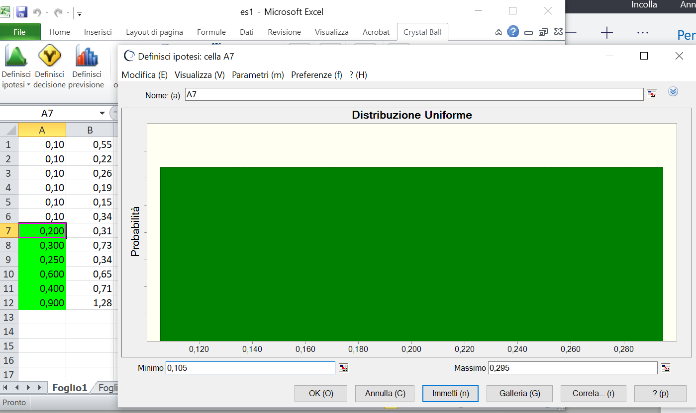

## Un possibile metodo di addestramento con Crystall Ball di Excel
Oracle Crystal Ball è una applicazione basata su fogli di calcolo per la modellazione predittiva, la previsione, la simulazione e l'ottimizzazione.
Quando la matrice di dataset è generata dall'intervento di piu' allarmi che possono avere tempi di risposta casuali all'interno di un range comunque definito o definibile, è possibile stabilire delle distribuzioni equiprobabili, o rettangolari, al fine di individuare il settore sulla curva logaritmica che rappresenta una specifica categoria di guasto

Facciamo un esempio prendendo a riferimento il dataset del guasto 3 già visto nella pagina di [Rappresentazione grafica del modello con PLC Siemens S7 1500](/math.md)

Supponiamo ad esempio di dover addestrare un il modello per il riconoscimento di un guasto nel cui dataset compaiono segnali prodotti da relè a tempo elettronici tipo Siemens 7PV15 per industria e infrastruttura, le cui informazioni sono scaricabili da Web alla pagina [Tia Selection Tool cloud](https://mall.industry.siemens.com/tst/#/Start)

Dal datasheet di evince che il campo di regolazione del tempo di intervento è compreso tra i 50 millisecondi e 100 ore. Supponiamo per semplicità di impostare il valore del contatto di scambio a 50ms. E' ragionevole supporre che esista una variabilità di questo valore legata a vari fattori come ad esempio la temperatura di esercizio. Tuttavia questa variabilità sarà compresa in un range ragionevole per le condizioni di impiego e d'uso del relè, ovvero potremmo stabilire che entro 100ms il relè abbia commutato.

Attraverso Crystall Ball si ricostruisce il dataset attribuendo però la variabilità del campo di intervento temporale visibile graficamente da celle con sfondo verde

La distribuzione rettangolare è impostata come da figura. La scelta è dovuta al fatto che in assenza di informazioni la distribuzione dei tempi è considerata equiprobabile

Nulla vieta però di utilizzare distribuzioni diverse 

Adesso prendiamo la matrice addestrata dei pesi e la carichiamo nel foglio di calcolo per ottenere la funzione z 

Il valore che otteniamo è appunto quello riportato sull'HMI nel campo azzurro di sommatoria denominato "z" ed è pari circa a 2,3 che rappresenta il valore dell'angolo in radianti

Dall'analisi probabilistica si osserva che, tenendo conto della variabilità del tempo di commutazione dei relè scelti, nel 98% dei casi l'angolo è compreso tra 2,15 e 2,60 radianti ovvero tra 123° e 150° gradi 
Prendendo a riferimento la spirale logaritmica dell'esempio della pagina [Rappresentazione grafica del modello con PLC Siemens S7 1500](math.md) con coefficiente b=0,35 si ottiene graficamente nel piano polare il seguente settore che identifica il guasto 3

